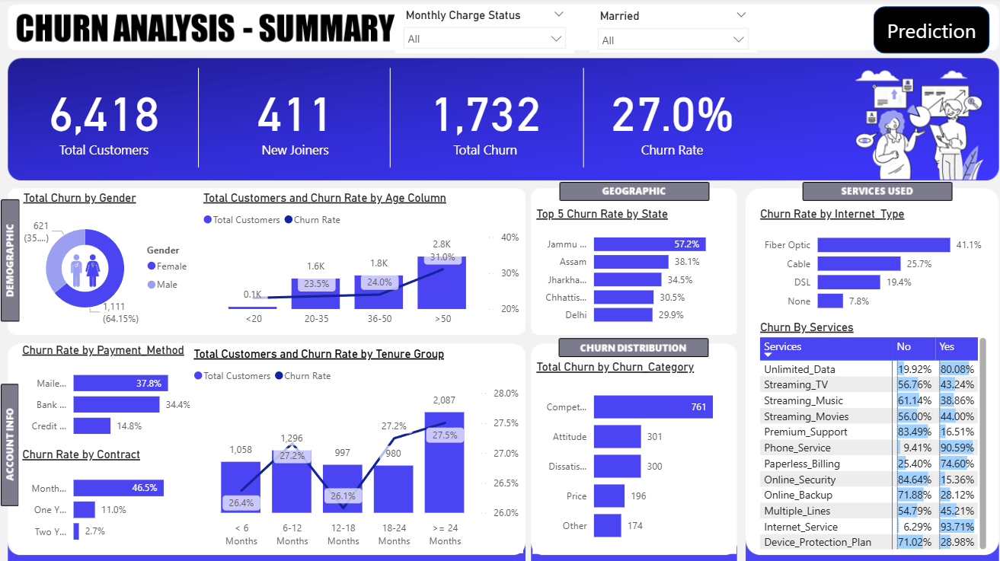
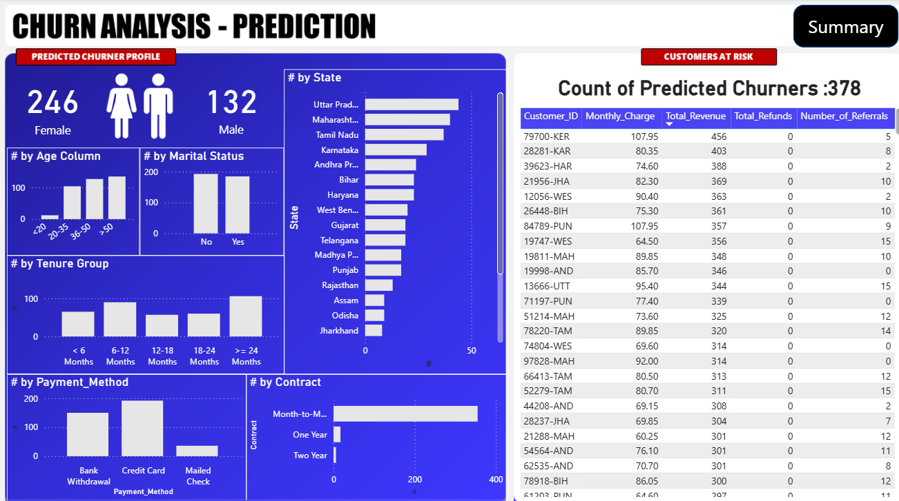

# Telecom Churn Analysis & Prediction

End-to-end Telecom Churn Analysis & Prediction project using SQL, Python, Machine Learning, and Power BI.

## 📸 Dashboard Preview

### Summary Dashboard



### Prediction Dashboard



---

## 📌 Project Overview

Customer churn is one of the biggest challenges faced by telecom companies. This project analyzes customer demographics, service usage, contract details, and revenue patterns to identify the factors that contribute to churn and predict customers who are likely to leave.

The project combines data analysis, machine learning, and business intelligence to provide actionable insights for improving customer retention.

---

## 🎯 Objectives

* Analyze customer behavior and churn patterns.
* Identify the key factors driving customer churn.
* Build a machine learning model to predict churn.
* Develop an interactive Power BI dashboard for business stakeholders.
* Provide data-driven recommendations to improve customer retention.

---

## 🛠️ Tech Stack

* **SQL** – Data Cleaning & Transformation
* **Python** – Data Analysis & Machine Learning
* **Pandas** – Data Manipulation
* **NumPy** – Numerical Computation
* **Matplotlib & Seaborn** – Data Visualization
* **Scikit-Learn** – Machine Learning
* **Power BI** – Interactive Dashboard

---

## 📂 Project Workflow

### 1. Data Cleaning

* Removed duplicates and handled missing values.
* Standardized categorical variables.
* Prepared data for analysis and modeling using SQL.

### 2. Exploratory Data Analysis (EDA)

* Customer Demographics Analysis
* Service Usage Analysis
* Contract Analysis
* Payment Method Analysis
* Geographic Analysis
* Churn Trend Analysis

### 3. Feature Engineering

* Encoding categorical variables
* Feature Selection
* Data Preprocessing for Machine Learning

### 4. Machine Learning

Built a churn prediction model to identify customers at risk of leaving.

### 5. Dashboard Development

Created an interactive Power BI dashboard containing:

* Customer Overview
* Churn Analysis
* Churn Prediction
* Customer Segmentation
* Business Insights

---

## 📊 Dashboard Features

### Summary Dashboard

* Total Customers
* New Joiners
* Total Churned Customers
* Churn Rate
* Churn by Gender
* Churn by Age Group
* Churn by State
* Churn by Internet Type
* Churn by Payment Method
* Churn by Contract Type
* Churn Categories
* Churn Reasons

### Prediction Dashboard

* Predicted Churn Customers
* Customer Risk Profiles
* Churn Probability Analysis
* Model Performance Metrics
* Top Churn Drivers

---

## 🔍 Key Insights

* Customers with **Month-to-Month contracts** have the highest churn rate.
* **Fiber Optic** users show significantly higher churn compared to other internet services.
* Customers aged **50+ years** are more likely to churn.
* **Competition** is the leading reason for customer churn.
* Long-term customers tend to have lower churn rates.

### Top Churn Drivers

1. Contract Type
2. Total Revenue
3. Total Charges
4. Monthly Charges
5. Total Long Distance Charges

---

## 🤖 Machine Learning Performance

| Metric    | Score |
| --------- | ----- |
| Accuracy  | 84%   |
| Precision | 78%   |
| Recall    | 65%   |
| F1 Score  | 71%   |

---

## 💡 Business Recommendations

* Encourage customers to switch from Month-to-Month contracts to annual plans.
* Investigate service issues affecting Fiber Optic customers.
* Launch retention campaigns targeting customers above 50 years of age.
* Provide loyalty rewards and special offers to long-tenure customers.
* Focus retention efforts on high-value customers identified by the prediction model.

---
```text
Telecom-Churn-Analysis/
│
├── Dashboard/
│   ├── Summary-Preview.png
│   ├── Prediction-Preview.png
│   └── Telecom_Churn.pbix
│
├── Dataset/
│
├── Images/
│
├── Notebook/
│
├── Report/
│   └── Telecom-Customer-Churn-Analysis.pptx
│
├── SQL/
│
├── .gitattributes
└── README.md
```
## 🚀 Future Improvements

* Deploy the churn prediction model as a web application.
* Implement real-time churn monitoring.
* Add Customer Lifetime Value (CLV) analysis.
* Compare multiple machine learning models.
* Integrate automated retention recommendations.

---

## 👨‍💻 Author

**Subhanu Dhar**

Aspiring Data Analyst | Machine Learning Enthusiast | Full-Stack Developer

If you found this project useful, consider giving it a ⭐ on GitHub.
